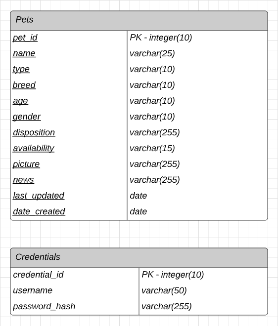
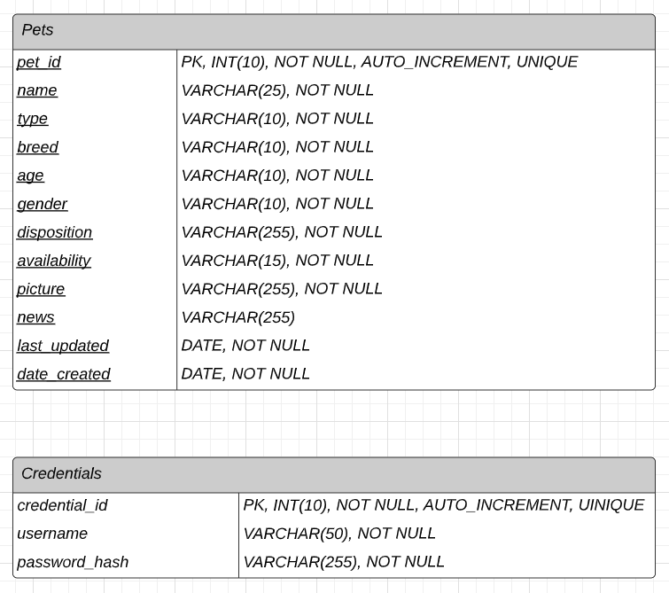

# OSU Capstone Project - Pet Adoption App
Contributors: Sebastian Espinas, Shawn Kim, Lauren Ruff, Neil Thayamballi

## Instructions: Running the Server Locally for development
1. In the terminal or CLI, navigate to the top level folder of the project
2. 
2. Type "python manage.py runserver" (without quotes) and hit enter
3. Open a second terminal and navigate to %project%/ReactFrontend
4. Type "npm start" (without quotes) and hit enter; your default browser should open to "localhost:3000/feed" to view the site

## Overview: Directory Structure
- Adopter: Our Main Project, includes setup for the program
- api: our backend, includes SQLite3 models
- frontend: all frontend data, including React, javascript, HTML, CSS, etc.
- frontend/src: all javascript (js/jsx) source code for rendering webpages with React
- frontend/static/css: css file
- frontend/static/frontend: our main.js file to be loaded by the system
- frontend/static/images: all image files
- frontend/templates: one HTML file that React will render the pages through

## Project Requirements
1. Accounts and login. Admin and public accounts.
2. Shelter needs to be able to create new "dating" profiles, with type of animal, breed, disposition, pic, availability, news item, and description.
3. Users can browse profiles to find a pet, or search by type, breed, disposition, or date created.
4. Animal types include dog and cat plus "other".
5. Breed shall be the most common ones plus "other".
6. Disposition are checkboxes that include "Good with other animals", "Good with children", "Animal must be leashed at all times".
7. Availability includes "Not Available", "Available", "Pending", "Adopted"
8. "News Item" is just a news/PR blurb.
9. Profiles can be removed when the animal is picked up.
10. App/website should have a landing page.

### Stretch Requirements:
- Update "News Item" to send current news and the image of animal to the Daily news feed queue (stretch requirement)
- Website needs to be responsive (viewable on desktop or mobile).
- Daily feed on app or website landing page offers the latest status updates on animals
- Email notifications for newly added profiles
- Pics can rotate through a set of images
- Set email preferences

## Project Plan
### Introduction
Our team will be creating a dynamic website using Javascript and Python that matches adoptable animals with potential owners. It will be set up like a dating application where animals  will each have a profile with their basic information and owners will be able to conduct searches with optional filtering for their perfect match. This project will help our team increase their Javascript, Python, and SQL database abilities.  

### User Perspective
From the user’s perspective, the website will provide an easy way to find a pet that matches their idea of a perfect match. This website will help those who are curious about potentially adopting a pet in the far future or those who are actively looking to adopt. Users can browse through the feed if they don’t have an idea on what kind of pet they are looking for, while users who know exactly what kind of pet they want can conduct a search with the appropriate filters to see if there is a match. The feed and search should be easy to navigate and always be up-to-date.  

### Software Structure
There will be three main components to the website: the user facing front end, the server-side backend, and the database.  
The user-facing component is expected to have five pages. Entering the site will take the user to the Landing page which will show a feed of pet updates, whether they be newly added pets, updated pets, or adoption success stories. This page will also give the user the ability to log in, sign up, or search for a pet. Signing up with a public account will provide the user with a recognized profile that, when accessed at any point with logging in, will allow the user to contact the adoption agency about available pets. Navigating to the Search page will allow the user to search through all available pets and filter their search by type, breed, age, or disposition. There will be one Administrative Account that the adoption agency has access to. This will give the adoption agency the ability to add, update, and delete pets from the database.   
The server-side backend will host and give the frontend access to those databases. The backend will also emulate a "secure login" process by generating a hash of the user’s password and storing it for look up for future login attempts.  
The main database is the PETS database. Each PET will have an ID, TYPE, BREED, AGE, DISPOSITION, PICTURE(S), AVAILABILITY, LOCATION, NEWS_ITEM, and DATE_CREATED. There will also be databases for TYPE, BREED, AGE, and DISPOSITION. This data will be pulled from to populate the Administration page and the Search page. The user’s login information will also be stored in a database, with an ID, EMAIL, and PASSWORD_HASH. 

#### Database ER Diagram

#### Database Schema

### Software Tools
- Figma for designing the website.
- Javascript (React), CSS, and Webpack for web-facing, user side.
- Python, Django, and Django Rest Framework (DRF) to create the server and host the database.
- Petfinder API to get data for our database.
- Generate SQL database with SQLite3.

### Conclusion
Our team’s goal is to create a seamless, easy-to-navigate website for those looking to adopt a pet, whether they are actively searching or are planning to adopt in the future. By using React, Python Django, and SQL, we will create a user-friendly, dynamic website with a reliable backend and accessible information for all available pets. This project will take roughly 320 hours to complete across all developers and each developer is expected to complete their tasks on time as noted in the Project Work section. Our collective efforts will ultimately lead to successful deployment and usability of this pet adoption website.    

#### References
Petfinder API: https://www.petfinder.com/developers/v2/docs/#get-animal   

